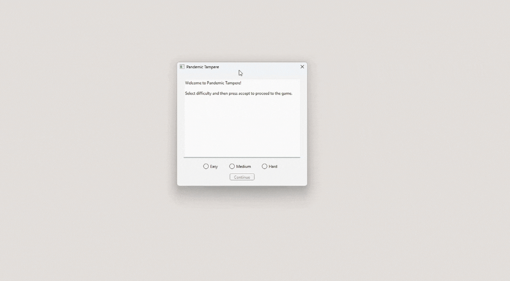

# Programming 3 final project: Pandemic Tampere

This is the final project from Tampere University course Programming 3: Techniques from fall 2020. In this pair assignment the group was given template code of Tampere's buss lines and their workings with the task to utilize the code to create some sort of game. Our group was inspired by the then ongoing global events and made a game where the task is to infect as many busses of passengers as possible by moving around the map and contaminating close by busses. The game has 3 difficulty settings which affect the speed of the player.

The project was written with C++, utilizing QtCreator and its libraries. Code insisde StudentSide namespace is the part students implemented so mainly files in Game folder.

## Showcase of the game

