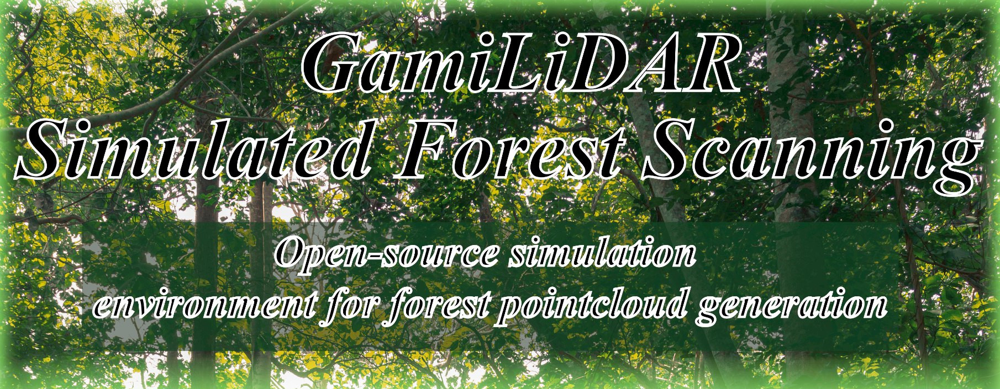

# Software Project 2: GamiLiDAR Simulated Forest Scanning

This is the poster and demo video of a project produced during the Tampere University course Software Project 2 in spring 2025. The project was completed by a group of six students, where some members acted as senior developers and others as junior developers based on their experience levels. I worked as a senior developer and test manager in this project.

## Subject

The product we developed is a simulation environment for testing GamiLiDAR gamified augmented reality applications. Our customer for the project was the GamiLiDAR research group at Tampere University, which develops mobile applications for gamified forest and environmental scanning using LiDAR scanners found in mobile phones.

Our task was to develop a virtual testing environment for these applications, allowing the research group to try out, test, and develop their mobile applications without needing to set up a mobile device and visit an actual forest every time an application needed to be run. As a proof of concept, we also developed a small prototype game that can be played within the simulation environment.

## Tech

The main goal of the course was to practice real-world software development. During the project, weekly meetings and coding sessions were held, the team communicated through Telegram, Discord, and Teams, and the project was organized using a fully developed issue board. Working hours were also tracked to meet course requirements.

The project was developed using the Unity platform and C#. The team used a GitLab repository with a custom CI/CD pipeline that ran on every commit to verify that the project could be built successfully and that all tests completed correctly.

## Demo Video

The  from our group'stion showcases the simulation environment, the prototype game, and how to use them. The video demonstrates how users can move around and scan the environment while saving scanned data points for later use.

The prototype UFO shooting game is shown in the latter part of the video.

Check out the GamiLiDAR research group: [GamiLiDAR](https://webpages.tuni.fi/gamification/projects/gamilidar/) and learn how their work in forest scanningto future environmental data collection.

## Final Seminar Poster

